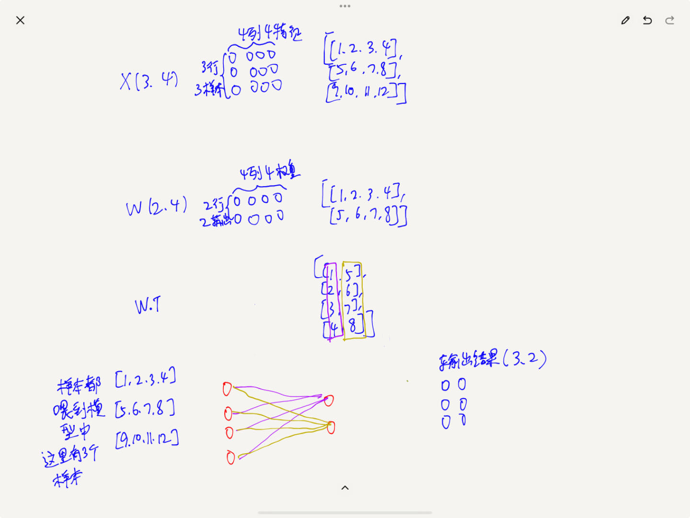

好的，让我们通过一个具体的例子来说明 `torch.matmul(X, W.T)` 的操作。

假设我们有以下两个张量：

*   `X` 是一个形状为 `(3, 4)` 的矩阵，表示有 3 个样本，每个样本有 4 个特征。
*   `W` 是一个形状为 `(2, 4)` 的矩阵，表示有 2 个输出节点，每个节点有 4 个权重。

具体数值如下：

    import torch
    
    # 定义输入张量 X
    X = torch.tensor([
        [1, 2, 3, 4],
        [5, 6, 7, 8],
        [9, 10, 11, 12]
    ])
    
    # 定义权重张量 W
    W = torch.tensor([
        [1, 2, 3, 4],
        [5, 6, 7, 8]
    ])
    

现在我们需要计算 `torch.matmul(X, W.T)`，即 `X` 与 `W` 的转置相乘。

首先，我们计算 `W` 的转置 `W.T`：

    W_T = W.T
    print(W_T)
    

输出结果为：

    tensor([
        [1, 5],
        [2, 6],
        [3, 7],
        [4, 8]
    ])
    

接下来，我们进行矩阵乘法 `torch.matmul(X, W.T)`：

    result = torch.matmul(X, W_T)
    print(result)
    

输出结果为：

    tensor([
        [ 30,  70],
        [ 70, 174],
        [110, 278]
    ])
    

具体计算过程如下：

*   对于 `result[0, 0]`，计算 `X[0, :]` 与 `W_T[:, 0]` 的点积：
    
        [1, 2, 3, 4] * [1, 2, 3, 4] = 1*1 + 2*2 + 3*3 + 4*4 = 1 + 4 + 9 + 16 = 30
        
    
*   对于 `result[0, 1]`，计算 `X[0, :]` 与 `W_T[:, 1]` 的点积：
    
        [1, 2, 3, 4] * [5, 6, 7, 8] = 1*5 + 2*6 + 3*7 + 4*8 = 5 + 12 + 21 + 32 = 70
        
    
*   对于 `result[1, 0]`，计算 `X[1, :]` 与 `W_T[:, 0]` 的点积：
    
        [5, 6, 7, 8] * [1, 2, 3, 4] = 5*1 + 6*2 + 7*3 + 8*4 = 5 + 12 + 21 + 32 = 70
        
    
*   对于 `result[1, 1]`，计算 `X[1, :]` 与 `W_T[:, 1]` 的点积：
    
        [5, 6, 7, 8] * [5, 6, 7, 8] = 5*5 + 6*6 + 7*7 + 8*8 = 25 + 36 + 49 + 64 = 174
        
    
*   对于 `result[2, 0]`，计算 `X[2, :]` 与 `W_T[:, 0]` 的点积：
    
        [9, 10, 11, 12] * [1, 2, 3, 4] = 9*1 + 10*2 + 11*3 + 12*4 = 9 + 20 + 33 + 48 = 110
        
    
*   对于 `result[2, 1]`，计算 `X[2, :]` 与 `W_T[:, 1]` 的点积：
    
        [9, 10, 11, 12] * [5, 6, 7, 8] = 9*5 + 10*6 + 11*7 + 12*8 = 45 + 60 + 77 + 96 = 278
        
    

最终结果为：

    tensor([
        [ 30,  70],
        [ 70, 174],
        [110, 278]
    ])
    

这个结果表示 `X` 与 `W` 的转置相乘后的矩阵，形状为 `(3, 2)`，即 3 个样本，每个样本有 2 个输出特征。

